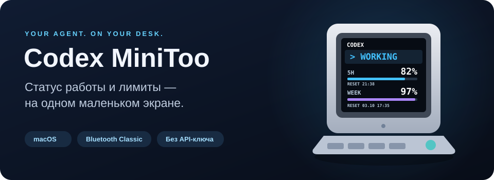
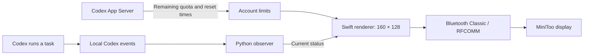
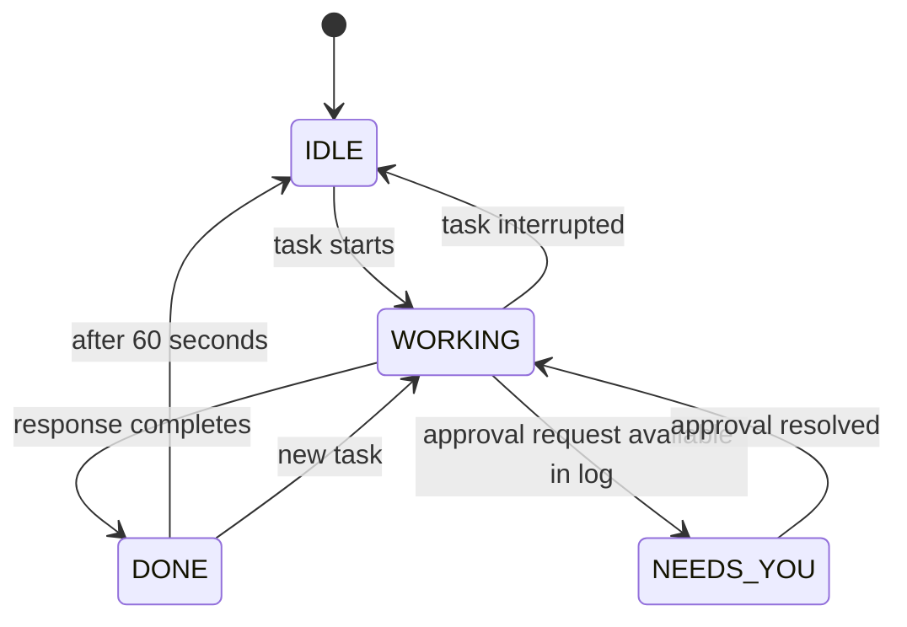

# Codex MiniToo

**English** · [Русский](README.ru.md)

**Live Codex status and account usage limits on your Divoom MiniToo.**



[Quick start](#quick-start) · [Screens](#four-states-one-screen) · [How it works](#how-it-works) · [Commands](#commands) · [Troubleshooting](#troubleshooting)

While Codex writes code, MiniToo shows **WORKING**. When the response is ready, it shows **DONE**. The same screen displays your remaining five-hour and weekly limits and their reset times, so you can follow your agent without opening the app.

The integration runs locally on macOS, connects over Bluetooth, and uses your existing Codex authentication. No separate API key or Divoom account is required.

## Four states, one screen

The images below come from **the same renderer used for the device display**. Percentages and reset times are examples. The banner uses a product photo with a simulated Codex monitoring screen.

| Working | Needs your attention |
|:---:|:---:|
|  |  |
| Codex is running a task | Approval requested, when the event is available in the log |

| Done | Idle |
|:---:|:---:|
|  |  |
| Response ready; shown for 60 seconds | No active work |

- Status and both usage limits stay visible **at the same time**.
- Colors and pixel icons make each state easy to recognize.
- The cyan bar shows the short-window balance; the purple bar shows the weekly balance. A bar turns red at **10% remaining or less**.
- `RESET` times use your Mac's local time zone.
- Designed for **160 × 128**: 18 px status and percentages, 8 px reset labels, and 5 px bars. JPEGs are sent at maximum quality.

## Quick start

### Requirements

| Component | Requirement |
|---|---|
| Device | Divoom MiniToo, powered on and paired with your Mac |
| Computer | macOS; Linux and Windows are not supported yet |
| Python | 3.9 or newer; no third-party Python packages |
| Build tools | Xcode Command Line Tools: `swiftc` and `codesign` |
| Codex | A local installation with logs in `~/.codex` and ChatGPT authentication |
| Internet | Needed to read usage limits; the display uses Bluetooth |

If you do not have the build tools installed:

```sh
xcode-select --install
```

### 1. Pair MiniToo

Open **System Settings → Bluetooth**, turn on MiniToo, and pair it with your Mac. Disconnect the Divoom phone app from the device so it does not occupy the connection.

### 2. Build and test the display

Open a terminal in the cloned project directory:

```sh
bash build.sh
python3 minitoo.py setup
python3 minitoo.py start
python3 minitoo.py state done
```

Allow Bluetooth access in macOS when prompted. MiniToo should display **DONE** alongside your usage limits.

If automatic discovery fails, provide **your MiniToo's** Bluetooth MAC address:

```sh
python3 minitoo.py setup --mac AA:BB:CC:DD:EE:FF
```

### 3. Enable automatic status updates

```sh
python3 install_service.py
```

The background service now follows real Codex events and starts when you log in to macOS. No Codex restart is needed; it can detect a task that is already running.

> The installer saves the absolute project path. If you move the directory, run `python3 install_service.py` again. If you previously used this integration's hooks, the installer removes only its own handlers, keeping a backup and preserving other hooks.

## How it works



The observer reads the task index in `~/.codex/state_*.sqlite` in **read-only mode** and watches for events appended to local JSONL logs. It checks known tasks every second and refreshes the task list every five seconds.

Usage limits come from the official [`account/rateLimits/read`](https://learn.chatgpt.com/docs/app-server) method in `codex app-server`. The renderer combines status and limits into an image. The Bluetooth helper sends it using the `0x8B` protocol, waiting for the upload announcement acknowledgement before transferring 256-byte chunks.



With multiple tasks, the priority is **NEEDS YOU → WORKING → DONE → IDLE**. One task finishing does not hide another task that is still running. States with no activity for over an hour are ignored.

### Understanding the limits

Percentages represent **remaining capacity**, not consumed usage. For example, `5H 82%` means 82% of the short-window quota remains. These limits apply to the whole account, not an individual project or task.

The service updates the image when the status changes and approximately once a minute to refresh limits. If a request fails, it keeps the last snapshot; after five minutes, it is marked **OLD DATA**. Unknown values appear as `--%`.

### Why the hourglass sometimes appears

**LOADING** is MiniToo's own screen while it receives and processes a new image. Transfers usually take a few seconds. Dynamic usage limits require image uploads, so the hourglass may appear during status changes and data refreshes.

## Commands

Run these commands from the project directory.

| Action | Command |
|---|---|
| Discover and save the MiniToo address | `python3 minitoo.py setup` |
| Start the Bluetooth helper | `python3 minitoo.py start` |
| Enable the observer and login startup | `python3 install_service.py` |
| Force a limits refresh and update the screen | `python3 minitoo.py limits` |
| Show working | `python3 minitoo.py state working` |
| Show waiting for approval | `python3 minitoo.py state waiting` |
| Show done | `python3 minitoo.py state done` |
| Show idle | `python3 minitoo.py state idle` |
| Stop the Bluetooth helper | `python3 minitoo.py stop` |

The observer may replace a manually selected screen with the real status on its next update. To test screens manually, temporarily stop the service:

```sh
launchctl bootout "gui/$(id -u)" \
  "$HOME/Library/LaunchAgents/local.codex.minitoo.watcher.plist"

python3 minitoo.py state working
python3 minitoo.py state waiting
python3 minitoo.py state done
python3 minitoo.py state idle

# Restore automatic tracking
python3 install_service.py
```

## Troubleshooting

| Symptom | What to check |
|---|---|
| MiniToo is not found | Pair it with your Mac; specify the address with `setup --mac` if needed |
| Bluetooth does not connect | Device power, macOS Bluetooth permission, and the phone app's connection |
| Status does not update automatically | Check `runtime/watcher.log` and `runtime/watcher-state.json`; reinstall the service |
| Limits show `--%` or OLD DATA | Check ChatGPT authentication in local Codex and internet access; run `python3 minitoo.py limits` |
| Only a Telegram icon appears | Remove `"display_mode": "notification"` from `config.json` to return to image mode |
| Helper will not restart after a crash | Confirm the old process has stopped, remove the leftover `runtime/commands.fifo`, then run `start` |

Follow the observer log:

```sh
tail -f runtime/watcher.log
```

Other diagnostic files:

```text
runtime/
├── bluetooth.log       # Connection, transfers, and MiniToo responses
├── launcher.log        # Output from older direct helper launches
├── watcher.log         # Real status transitions and errors
├── watcher-state.json  # Last displayed state
└── limits.json         # Limits snapshot, without authentication tokens
```

### Disable the service and remove login startup

```sh
launchctl bootout "gui/$(id -u)" \
  "$HOME/Library/LaunchAgents/local.codex.minitoo.watcher.plist"
rm "$HOME/Library/LaunchAgents/local.codex.minitoo.watcher.plist"
python3 minitoo.py stop
```

## Limitations

- **NEEDS YOU depends on your Codex version.** Start and completion have been verified against real logs. Waiting for approval is detected only if the app records a corresponding event. An ordinary question from the assistant is not detected as waiting.
- Codex's local index and log formats may change after an app update.
- MiniToo's protocol is unofficial. Compatibility with other Divoom models has not been tested.
- Image transfers take time; they are not instant switches between preloaded clock faces.
- The observer examines up to 100 recent, non-archived tasks.

## Additional modes

<details>
<summary><strong>Switch between preloaded screens</strong></summary>

If you have already uploaded custom screens to MiniToo, specify the actual device and clock IDs:

```json
{
  "mac": "AA:BB:CC:DD:EE:FF",
  "device_id": 123456,
  "clock_ids": {
    "working": 1001,
    "waiting": 1002,
    "done": 1003,
    "idle": 1003
  }
}
```

These numbers are **examples**, not ready-to-use IDs. For these states, the integration sends `Channel/SetClockSelectId` instead of an image. Dynamic usage limits are not drawn on preloaded screens. The integration does not upload clock faces or log in to a Divoom account.

</details>

<details>
<summary><strong>Short notifications and hooks</strong></summary>

For short notifications, add `"display_mode": "notification"` to `config.json`. Some firmware versions show only a built-in app icon and ignore the text, so the main mode uses custom images.

For a separate hook-based workflow, `python3 minitoo.py hooks` and `python3 minitoo.py install-hooks` are available. Codex requires you to review and trust new hooks through `/hooks`. Do not enable hooks alongside the observer: both would control the same display.

</details>

## Development

```text
codex-minitoo/
├── minitoo.py                 # CLI, rendering, uploads, and hook compatibility
├── watch_codex.py             # Observe real Codex activity
├── usage_limits.py            # Read limits through Codex App Server
├── install_service.py         # Install a per-user LaunchAgent
├── build.sh                   # Build Swift components
├── transport/
│   ├── divoom-send.swift       # Bluetooth Classic / RFCOMM helper
│   └── render-status.swift     # Display interface
├── tests/                     # Protocol and state coordination tests
├── README.md                  # English documentation
├── README.ru.md               # Russian documentation
└── docs/assets/               # Banner and screen examples
```

Run tests:

```sh
python3 -m unittest discover -s tests -v
```

Change the interface:

```sh
# Edit transport/render-status.swift, then rebuild
bash build.sh
python3 minitoo.py limits
```

`config.json`, `runtime/`, `vendor/`, logs, and Python caches are excluded from Git. The integration does not save task text or authentication tokens, or send them to MiniToo. Codex manages the authentication used to read limits.

## Credits

The Bluetooth transport is based on [bugzmanov/divoom-minitoo](https://github.com/bugzmanov/divoom-minitoo), commit `f8e48705c2c8f791545821a4740aeddc2eb7a9fa`. Changes add a configurable log path and FIFO permissions of `0600`. The project builds from Swift source; third-party prebuilt binaries are not required.

Documentation: [Codex App Server](https://learn.chatgpt.com/docs/app-server) · [Codex hooks](https://learn.chatgpt.com/docs/hooks).

This project is not affiliated with OpenAI or Divoom and is not an official integration.
