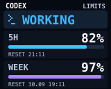
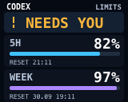
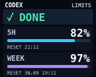
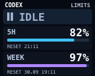
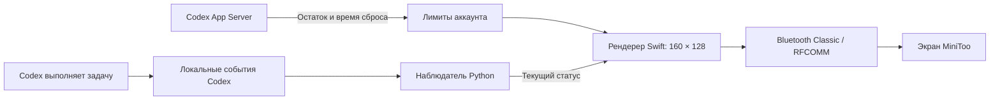
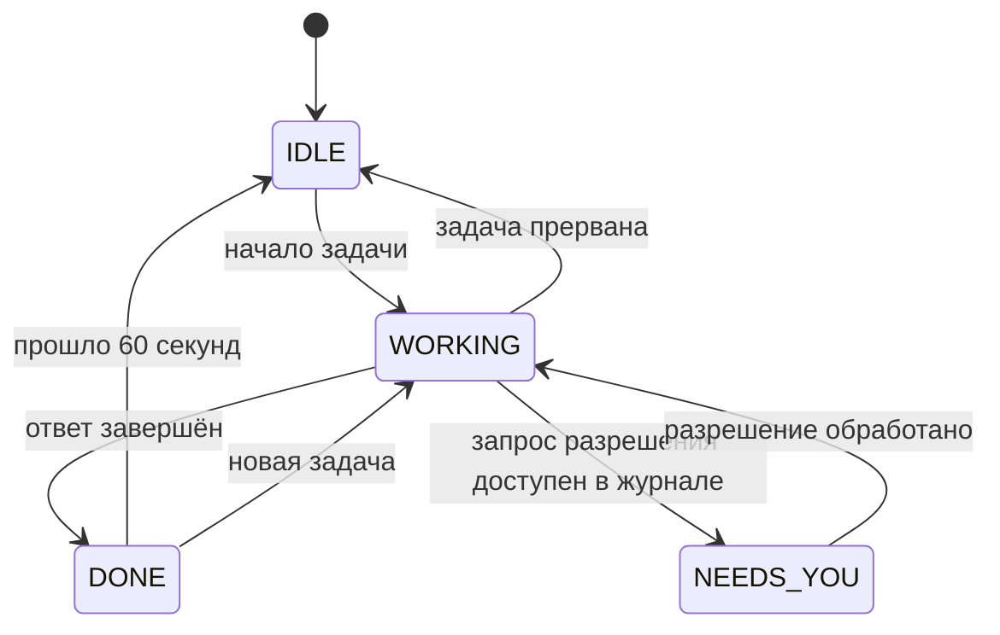

# Codex MiniToo

[English](README.md) · **Русский**

**Живой статус Codex и лимиты аккаунта на экране Divoom MiniToo.**


[Быстрый старт](#быстрый-старт) · [Экраны](#четыре-состояния-один-экран) · [Как работает](#как-это-работает) · [Команды](#команды) · [Диагностика](#диагностика)

Пока Codex пишет код, MiniToo показывает **WORKING**. Когда ответ готов — **DONE**. На том же экране видны остаток пятичасового и недельного лимитов и время их сброса. Можно следить за работой агента, не открывая окно приложения.

Интеграция работает локально на macOS, подключается по Bluetooth и использует текущую авторизацию Codex. Отдельные API-ключ и аккаунт Divoom не нужны.

## Четыре состояния, один экран

Изображения ниже созданы **тем же рендерером, который рисует экран устройства**. Проценты и время здесь демонстрационные. В баннере использована фотография устройства с добавленным экраном мониторинга Codex.

| Работа | Нужен пользователь |
|:---:|:---:|
|  |  |
| Codex выполняет задачу | Запрос разрешения, если событие доступно в журнале |

| Завершено | Простой |
|:---:|:---:|
|  |  |
| Ответ готов; экран держится 60 секунд | Нет активной работы |

- Статус и оба лимита отображаются **одновременно**.
- Цвет и пиксельный значок помогают различать состояния с первого взгляда.
- Голубая полоса — остаток короткого окна, фиолетовая — недельного. При остатке **10% или меньше** полоса становится красной.
- Время `RESET` показывается в часовом поясе Mac.
- Интерфейс рассчитан на **160 × 128**: статус и проценты 18 px, подписи сброса 8 px, полосы 5 px. JPEG передаётся с максимальным качеством.

## Быстрый старт

### Что понадобится

| Компонент | Требование |
|---|---|
| Устройство | Divoom MiniToo, включённый и сопряжённый с Mac |
| Компьютер | macOS; Linux и Windows пока не поддерживаются |
| Python | 3.9 или новее, без сторонних Python-пакетов |
| Сборка | Xcode Command Line Tools: `swiftc` и `codesign` |
| Codex | Локальная установка с журналами в `~/.codex` и авторизацией ChatGPT |
| Интернет | Для чтения лимитов; Bluetooth используется для экрана |

Если инструменты сборки ещё не установлены:

```sh
xcode-select --install
```

### 1. Сопрягите MiniToo

Откройте **Настройки системы → Bluetooth**, включите MiniToo и подключите его. Отключите приложение Divoom на телефоне от устройства, чтобы оно не занимало соединение.

### 2. Соберите и проверьте экран

Откройте терминал в папке клонированного проекта:

```sh
bash build.sh
python3 minitoo.py setup
python3 minitoo.py start
python3 minitoo.py state done
```

При первом запуске разрешите доступ к Bluetooth в macOS. На MiniToo должен появиться **DONE** вместе с лимитами.

Если адрес не определился автоматически, укажите Bluetooth MAC **своего MiniToo**:

```sh
python3 minitoo.py setup --mac AA:BB:CC:DD:EE:FF
```

### 3. Включите автоматическое переключение

```sh
python3 install_service.py
```

Готово. Фоновый сервис отслеживает реальные события Codex и запускается при входе в macOS. Перезапуск Codex не нужен: он может обнаружить уже выполняющуюся задачу.

> Установщик сохраняет абсолютный путь к проекту. Если переместите папку, повторите `python3 install_service.py`. Если ранее использовали hooks этой интеграции, установщик удалит только их обработчики, сохранив резервную копию и остальные hooks.

## Как это работает



Наблюдатель читает индекс задач `~/.codex/state_*.sqlite` в режиме **только чтения** и следит за добавлением событий в локальные JSONL-журналы. Изменения известных задач проверяются каждую секунду, список задач — каждые пять секунд.

Лимиты читаются через официальный метод [`account/rateLimits/read`](https://learn.chatgpt.com/docs/app-server) в `codex app-server`. Рендерер объединяет статус и лимиты в изображение. Bluetooth helper передаёт его по протоколу `0x8B`, ожидая подтверждения начала загрузки и отправляя блоки по 256 байт.



Если работает несколько задач, используется приоритет: **NEEDS YOU → WORKING → DONE → IDLE**. Завершение одной задачи не скрывает работу другой. Неактивные состояния старше часа не учитываются.

### Что означают лимиты

Проценты показывают **доступный остаток**, а не использованную долю. Например, `5H 82%` означает, что в коротком окне осталось 82% лимита. Это лимиты всего аккаунта, не отдельного проекта или задачи.

Сервис обновляет изображение при смене статуса и примерно раз в минуту для обновления лимитов. Если запрос не удался, используется последний снимок; спустя пять минут он помечается **OLD DATA**. Неизвестные значения отображаются как `--%`.

### Почему иногда появляются песочные часы

**LOADING** — экран самого MiniToo во время приёма и обработки нового изображения. Передача обычно занимает несколько секунд. При динамических лимитах изображение приходится загружать повторно, поэтому песочные часы могут появляться при смене статуса и обновлении данных.

## Команды

Выполняйте команды из папки проекта.

| Действие | Команда |
|---|---|
| Найти и сохранить адрес MiniToo | `python3 minitoo.py setup` |
| Запустить Bluetooth helper | `python3 minitoo.py start` |
| Включить наблюдатель и автозапуск | `python3 install_service.py` |
| Принудительно обновить лимиты и экран | `python3 minitoo.py limits` |
| Показать работу | `python3 minitoo.py state working` |
| Показать ожидание разрешения | `python3 minitoo.py state waiting` |
| Показать завершение | `python3 minitoo.py state done` |
| Показать простой | `python3 minitoo.py state idle` |
| Остановить Bluetooth helper | `python3 minitoo.py stop` |

Наблюдатель может заменить вручную выбранный экран реальным статусом при следующем обновлении. Для ручного тестирования временно остановите сервис:

```sh
launchctl bootout "gui/$(id -u)" \
  "$HOME/Library/LaunchAgents/local.codex.minitoo.watcher.plist"

python3 minitoo.py state working
python3 minitoo.py state waiting
python3 minitoo.py state done
python3 minitoo.py state idle

# Вернуть автоматическое отслеживание
python3 install_service.py
```

## Диагностика

| Симптом | Что проверить |
|---|---|
| MiniToo не найден | Сопряжение с Mac; при необходимости укажите адрес через `setup --mac` |
| Bluetooth не подключается | Питание MiniToo, разрешение Bluetooth в macOS, соединение с приложением на телефоне |
| Экран не меняется автоматически | `runtime/watcher.log` и `runtime/watcher-state.json`; повторите установку сервиса |
| Лимиты показывают `--%` или OLD DATA | Авторизацию ChatGPT в локальном Codex и доступ к интернету; выполните `python3 minitoo.py limits` |
| Отображается только значок Telegram | Удалите `"display_mode": "notification"` из `config.json`, чтобы вернуться к изображениям |
| После аварии helper не запускается | Проверьте, что старый процесс завершён, удалите оставшийся `runtime/commands.fifo`, затем выполните `start` |

Посмотреть работу наблюдателя:

```sh
tail -f runtime/watcher.log
```

Другие диагностические файлы:

```text
runtime/
├── bluetooth.log       # соединение, отправка и ответы MiniToo
├── launcher.log        # вывод Bluetooth helper
├── watcher.log         # переключения реальных состояний и ошибки
├── watcher-state.json  # последнее показанное состояние
└── limits.json         # снимок лимитов, без токенов авторизации
```

### Отключение и удаление автозапуска

```sh
launchctl bootout "gui/$(id -u)" \
  "$HOME/Library/LaunchAgents/local.codex.minitoo.watcher.plist"
rm "$HOME/Library/LaunchAgents/local.codex.minitoo.watcher.plist"
python3 minitoo.py stop
```

## Ограничения

- **NEEDS YOU зависит от версии Codex.** Начало и завершение проверены на реальных журналах. Ожидание разрешения отображается только если приложение сохраняет соответствующее событие. Произвольный вопрос ассистента не определяется как ожидание.
- Формат локального индекса и журналов Codex может измениться после обновления приложения.
- Протокол MiniToo неофициальный. На других моделях Divoom совместимость не проверялась.
- Передача изображений занимает время; это не мгновенное переключение заранее загруженных циферблатов.
- Фоновый наблюдатель просматривает до 100 последних неархивированных задач.

## Дополнительные режимы

<details>
<summary><strong>Переключение заранее загруженных экранов</strong></summary>

Если пользовательские экраны уже загружены в MiniToo, можно задать реальные ID устройства и циферблатов:

```json
{
  "mac": "AA:BB:CC:DD:EE:FF",
  "device_id": 123456,
  "clock_ids": {
    "working": 1001,
    "waiting": 1002,
    "done": 1003,
    "idle": 1003
  }
}
```

Эти числа — **пример**, не готовые ID. Для указанных состояний отправляется `Channel/SetClockSelectId` вместо изображения. На заранее загруженном экране динамические лимиты не рисуются. Интеграция не выполняет загрузку циферблатов или вход в аккаунт Divoom.

</details>

<details>
<summary><strong>Короткие уведомления и hooks</strong></summary>

Для коротких уведомлений добавьте `"display_mode": "notification"` в `config.json`. Некоторые прошивки показывают только встроенный значок приложения, игнорируя текст, поэтому основной режим использует собственные изображения.

Для отдельного сценария с hooks доступны `python3 minitoo.py hooks` и `python3 minitoo.py install-hooks`. Codex требует просмотра и доверия новым hooks через `/hooks`. Не включайте hooks одновременно с фоновым наблюдателем: оба способа будут управлять одним экраном.

</details>

## Для разработчиков

```text
codex-minitoo/
├── minitoo.py                 # CLI, рендеринг, загрузка экрана и совместимость с hooks
├── watch_codex.py             # наблюдение за реальной работой Codex
├── usage_limits.py            # клиент чтения лимитов через Codex App Server
├── install_service.py         # установка пользовательского LaunchAgent
├── build.sh                   # сборка Swift-компонентов
├── transport/
│   ├── divoom-send.swift       # Bluetooth Classic / RFCOMM helper
│   └── render-status.swift     # интерфейс экрана
├── tests/                     # тесты протокола и согласования состояний
└── docs/assets/               # иллюстрация и примеры для README
```

Запуск тестов:

```sh
python3 -m unittest discover -s tests -v
```

Изменение интерфейса:

```sh
# Отредактируйте transport/render-status.swift, затем пересоберите
bash build.sh
python3 minitoo.py limits
```

`config.json`, `runtime/`, `vendor/`, логи и Python-кэши исключены из Git. Тексты задач и токены авторизации не сохраняются интеграцией и не передаются на MiniToo. Для лимитов используется авторизация, которой управляет сам Codex.

## Благодарности

Bluetooth transport основан на [bugzmanov/divoom-minitoo](https://github.com/bugzmanov/divoom-minitoo), commit `f8e48705c2c8f791545821a4740aeddc2eb7a9fa`. В исходник добавлены настраиваемый путь лога и права FIFO `0600`. Проект использует исходный Swift-код; сторонние готовые бинарники не нужны для сборки.

Документация: [Codex App Server](https://learn.chatgpt.com/docs/app-server) · [Codex hooks](https://learn.chatgpt.com/docs/hooks).

Проект не связан с OpenAI или Divoom и не является их официальной интеграцией.
